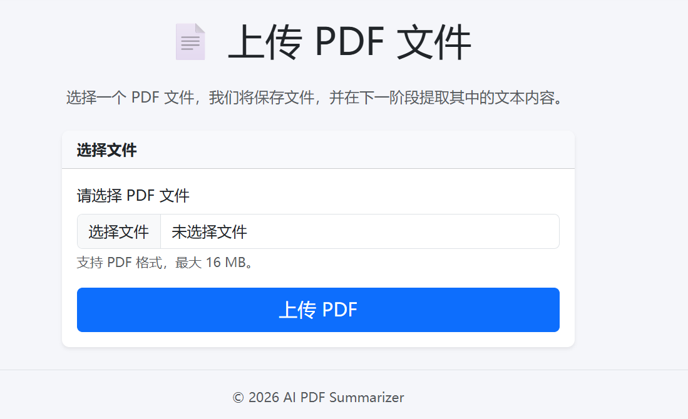
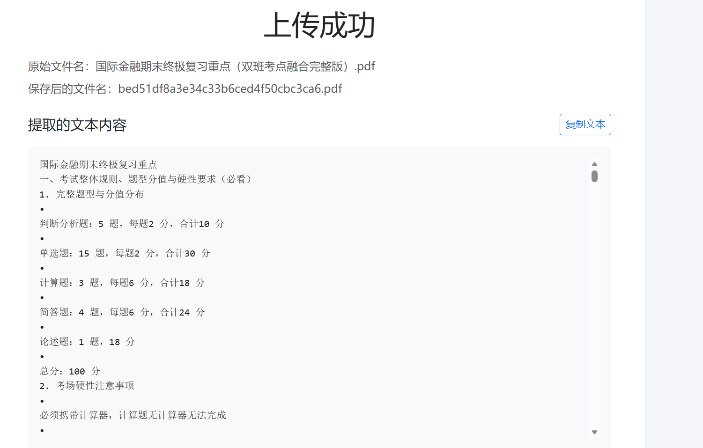

# AI PDF Summarizer

AI PDF Summarizer 是一个基于 Flask 的 PDF 文档处理 Web 应用。用户可以上传 PDF 文件，系统会安全保存文件、提取文档文本，并在响应式结果页面中展示内容。

项目目前专注于构建清晰、可靠的 PDF 上传与文本提取流程，为后续生成 AI 复习资料奠定基础。

## 项目截图

### 首页上传页面



### PDF 文本提取结果页



## 当前功能

- 上传并保存单个 PDF 文件
- 校验文件扩展名并安全处理文件名
- 使用 UUID 生成唯一保存文件名，避免同名文件覆盖
- 使用 PyMuPDF 提取 PDF 文本
- 处理空白、损坏、伪造或加密 PDF
- 显示原始文件名、保存文件名和提取结果
- 使用固定高度滚动区域展示长文本
- 一键复制提取文本
- 使用统一错误页面反馈上传问题
- 选择需要生成的复习资料类型
- 根据所选类型展示复习资料预览占位内容

## 技术栈

- Python
- Flask
- PyMuPDF
- Bootstrap 5
- HTML / CSS / JavaScript

## 项目结构

```text
ai-pdf-summarizer/
├── app/
│   ├── static/
│   │   ├── css/
│   │   │   └── style.css       # 自定义页面样式
│   │   └── js/
│   │       └── main.js         # 复制文本交互
│   ├── templates/
│   │   ├── base.html           # 基础页面模板
│   │   ├── error.html          # 统一错误页面
│   │   ├── index.html          # PDF 上传页面
│   │   └── result.html         # 文本提取结果页面
│   ├── utils/
│   │   └── pdf_utils.py        # PDF 文本提取工具
│   ├── __init__.py             # Flask 应用工厂
│   ├── study_options.py        # 复习资料选项配置
│   └── routes.py               # 页面与上传路由
├── docs/
│   └── images/                 # 项目截图
├── uploads/                    # 上传文件目录（不纳入 Git）
├── config.py                   # 应用配置
├── requirements.txt            # Python 依赖
├── run.py                      # 项目启动入口
└── README.md
```

## 运行方法

```bash
pip install -r requirements.txt
python run.py
```

启动后访问：`http://127.0.0.1:5000`

## 版本进度

### 当前版本：v0.8

- [x] Flask 项目基础结构
- [x] Bootstrap 5 响应式页面
- [x] PDF 上传与本地保存
- [x] 上传文件名唯一化
- [x] PDF 文本提取
- [x] 异常文件处理
- [x] 长文本滚动展示
- [x] 提取文本复制
- [x] 统一错误页面
- [x] 复习资料类型选择
- [x] 复习资料预览区域

### 后续计划

- [ ] AI 复习资料生成
- [ ] Markdown 导出
- [ ] 部署上线
